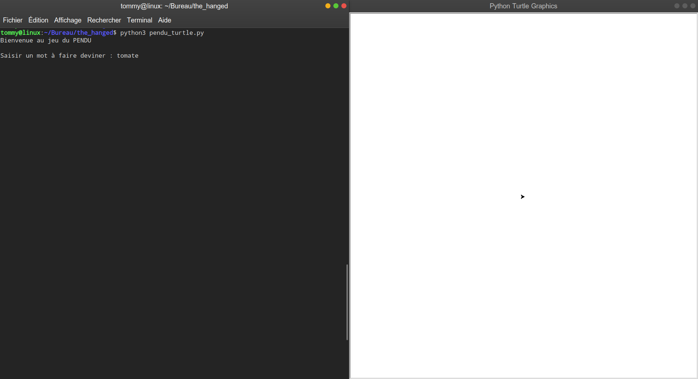
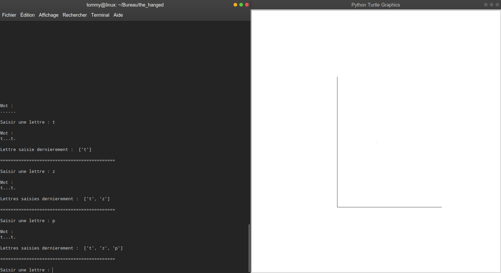
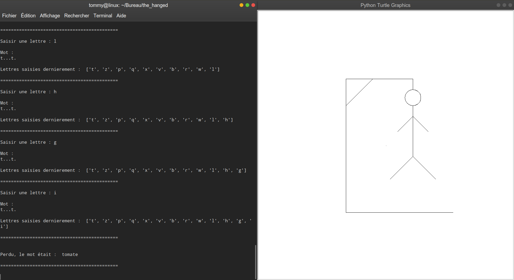

# Power 4

This project is the hanged man's game. 

I did it in 2018, during my 2nd year of university license. This is a personnel project, and is developed in Python3.

## Rules
One player choose a word to guess. The other player must guess the word, in 12 chances.

## To begin
Do the command :  `$ git clone https://github.com/debroucker/the_hanged.git` to recover this repository.

## Prerequisite
You need to have Python3.
So, if you haven't it, do the command : `$ sudo apt-get install python3`

## Start-up
To lunch the game, do the command : `$ python3 pendu_turtle.py`, and enjoy.

## Made with
Visual Studio Code

## Authors
DEBROUCKER Tommy